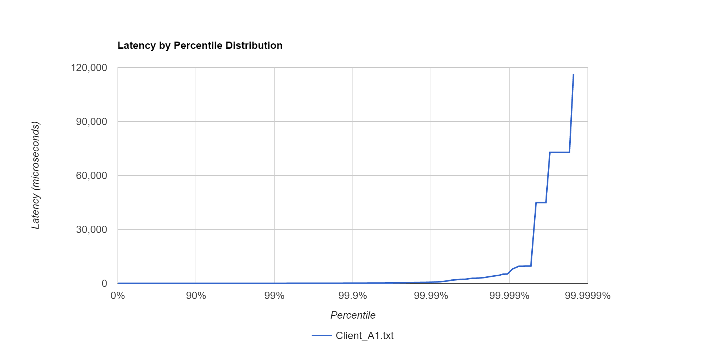

# MarketData

[Motivation for this project](./background.md)

This project - MarketData - is an interesting high performance / low latency problem.  I work with market data in my
day job but I don't collect data from exchanges, instead there is another team that connects to various providers,
collects data, converts to company specific format and publishes to other applications (e.g. my application). The market
data collection application is written in C++, however they provide Java library for other application teams to consume
market data.  I don't have access to application code nor I want it because I want to try fresh ideas and learn by
making mistakes.

Therefore, in this project, I will build market data collection and distribution services.  The goals are:

- Java 1.8
- Garbage free
- Low latency: 100s nanos.
- Internal conflation: 1%
- Messages per second: 1,000,000

Design
- A typical client server architecture.  
- Server publishes market data.
- Client subscribes to market data.

Attempt 1 - Local host , loopback (no network)

Client Results (no warm-up)
    
    Java Serialization :
        - P99 : 23.711 micros
        - Max : 116391.935 micros
        - 645527 out of 1 million (64.5%)
        - 0 out of orders packets
        - 
    
    ByteBuffer Serialization :
        - P99 : 1.185 micros
        - Max : 2297.855 micros
        - 854971 out of 1 million (85.4%)
        - 0 out of order packets
        - [Chart](data/Histogram_Client_A2.png)

    Unsafe Serialization :
        - P99 : 1.185 micros
        - Max : 5521.407 micros
        - 846712 out of 1 million  (84.6%)
        - 0 out of order packets
        - [Chart](data/Histogram_Client_A3.png)

- data folder for percentiles and charts
 
Server Results (no warm-up)
- data folders - for percentiles and charts
 
Result Summary:
 - Latency in 1000s nanos.
 - 1+ YG collections.
 - 0 FG collection.
 - Not all messages processed by client.
(basically more work to be done to meet original goals)

